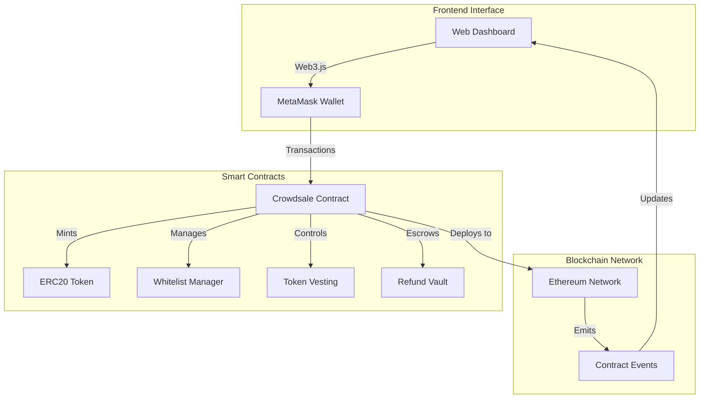

# ERC20代币众筹平台 (TokenCrowdsale)

🚀 **基于 Solidity + Foundry 的去中心化众筹平台**

[](https://getfoundry.sh/)
[](LICENSE)
[](https://docs.soliditylang.org/)

## 📋 项目描述

这是一个功能完整的去中心化代币众筹平台，支持项目方通过发行 ERC20 代币进行资金募集。系统采用模块化智能合约架构，集成了白名单预售、公开销售、自动退款、代币释放等完整众筹流程，并提供了直观的 Web 前端界面进行交互演示。

### 🎯 核心价值
- **多阶段众筹**: 支持白名单预售和公开销售的完整众筹周期
- **灵活价格机制**: 支持固定价格、折扣价格和动态价格曲线
- **智能资金管理**: 软顶/硬顶目标设置，自动退款和资金分配
- **代币释放机制**: 支持线性释放和阶梯式释放多种策略
- **安全保障**: 基于 OpenZeppelin 的企业级安全合约库

## ⚙️ 技术栈

### 智能合约技术
- **Solidity ^0.8.28** - 智能合约开发语言
- **Foundry** - 现代化 Solidity 开发框架
- **OpenZeppelin** - 安全的智能合约库
- **Forge** - 智能合约测试和部署工具

### 前端技术
- **HTML5 + CSS3** - 现代化响应式界面
- **Vanilla JavaScript** - 零依赖前端实现
- **Web3.js** - 区块链交互库
- **MetaMask** - 钱包连接和交易签名

### 开发工具
- **Foundry Forge** - 合约编译和测试
- **Foundry Cast** - 区块链交互命令行工具
- **Foundry Anvil** - 本地测试网络
- **Slither** - 静态安全分析工具

## 📊 系统架构图



## 🚀 功能特点

### 🎯 智能众筹系统
- **多阶段销售**: 白名单预售 → 公开销售的完整销售周期
- **灵活定价**: 支持固定价格、早鸟折扣和动态价格曲线
- **目标管理**: 软顶/硬顶目标设置，达成条件自动触发
- **KYC集成**: 预留 KYC 验证接口，支持合规要求

### 💰 资金安全保障
- **托管机制**: 资金安全托管，达标后自动释放
- **自动退款**: 未达软顶自动触发全额退款
- **紧急暂停**: 管理员紧急暂停和恢复功能
- **多重签名**: 支持多重签名钱包管理

### 🔒 代币释放机制
- **线性释放**: 按时间线性释放代币，防止抛售
- **阶梯释放**: 分阶段释放，灵活控制市场流通量
- **悬崖期设置**: 支持初始锁定期配置
- **释放查询**: 实时查询可释放代币数量

### 🛡️ 企业级安全
- **OpenZeppelin标准**: 基于行业标准安全合约库
- **权限控制**: 基于角色的访问控制系统
- **重入保护**: 防止重入攻击的安全措施
- **溢出保护**: SafeMath 防止整数溢出

### 🧪 测试与质量保证
- **Foundry原生测试**: 高效的 Solidity 测试套件
- **模糊测试**: Fuzz Testing 发现边界条件问题
- **Gas优化**: 详细的 Gas 消耗分析和优化
- **安全审计**: Slither 静态分析确保代码安全

### 🌐 用户友好界面
- **实时数据展示**: 众筹进度、剩余时间、参与统计
- **钱包集成**: 一键连接 MetaMask 钱包
- **交易历史**: 完整的参与记录和代币余额查询
- **响应式设计**: 支持桌面和移动端访问

## 📁 项目目录结构

```
simplied-token-crowd-sale-solidity/
├── contracts/
│   ├── TokenCrowdsale.sol           # 主众筹合约
│   ├── CrowdsaleToken.sol           # ERC20代币合约
│   ├── WhitelistManager.sol         # 白名单管理合约
│   ├── TokenVesting.sol             # 代币释放合约
│   ├── RefundVault.sol              # 退款管理合约
│   └── interfaces/
│       ├── ICrowdsale.sol           # 众筹接口
│       └── ITokenVesting.sol        # 代币释放接口
├── test/
│   ├── TokenCrowdsale.t.sol         # 主合约测试
│   ├── integration/
│   │   ├── CrowdsaleFlow.t.sol      # 集成流程测试
│   │   └── RefundScenario.t.sol     # 退款场景测试
│   ├── fuzz/
│   │   ├── CrowdsaleFuzz.t.sol      # 模糊测试
│   │   └── PricingFuzz.t.sol        # 价格机制模糊测试
│   └── utils/
│       ├── TestUtils.sol            # 测试工具合约
│       └── MockContracts.sol        # Mock合约
├── script/
│   ├── Deploy.s.sol                 # 部署脚本
│   ├── ConfigureCrowdsale.s.sol     # 配置脚本
│   └── UpgradeContracts.s.sol       # 升级脚本
├── web/
│   ├── index.html                   # 前端主页面
│   ├── js/
│   │   ├── app.js                   # 主应用逻辑
│   │   ├── web3-integration.js      # Web3集成
│   │   └── contract-abi.js          # 合约ABI定义
│   ├── css/
│   │   ├── style.css                # 主样式文件
│   │   └── responsive.css           # 响应式样式
│   └── assets/
│       └── images/                  # 图片资源
├── docs/
│   ├── TokenomicsDesign.md          # 代币经济学设计
│   ├── SecurityAudit.md             # 安全审计报告
│   └── GasOptimization.md           # Gas优化分析
├── foundry.toml                     # Foundry配置文件
├── Makefile                         # 构建脚本
├── README.md                        # 项目说明文档
└── DEVELOPMENT.md                   # 开发实践指南
```

## 🚀 快速开始

### 环境要求

- **Foundry** - Solidity 开发框架
- **Node.js 16+** - 前端依赖管理
- **Git** - 版本控制
- **MetaMask** - 浏览器钱包插件

### 安装和运行

1. **克隆项目**
```bash
git clone https://github.com/samxie52/simplied-token-crowd-sale-solidity.git
cd simplied-token-crowd-sale-solidity
```

2. **安装 Foundry**
```bash
curl -L https://foundry.paradigm.xyz | bash
foundryup
```

3. **安装依赖**
```bash
forge install
```

4. **编译合约**
```bash
forge build
```

5. **运行测试**
```bash
# 运行所有测试
forge test

# 运行特定测试
forge test --match-contract TokenCrowdsaleTest

# 运行模糊测试
forge test --match-contract CrowdsaleFuzz -vvv

# Gas报告
forge test --gas-report
```

6. **启动本地测试网**
```bash
anvil
```

7. **部署合约（新终端）**
```bash
# 部署到本地网络
make deploy-local

# 部署到测试网
make deploy-testnet
```

8. **启动前端界面**
```bash
cd web
python3 -m http.server 8000
# 访问 http://localhost:8000
```

## 🛠️ 开发和构建

### 本地开发

```bash
# 编译合约
make build
# 或
forge build

# 运行所有测试
make test
# 或
forge test -vvv

# 格式化代码
make fmt
# 或
forge fmt

# 安全检查
make security
# 或
slither contracts/

# Gas基准测试
make gas-benchmark
# 或
forge test --gas-report --json > gas-report.json
```

### 测试套件

```bash
# 单元测试
forge test --match-contract TokenCrowdsaleTest

# 集成测试
forge test --match-contract CrowdsaleFlowTest

# 模糊测试
forge test --match-contract Fuzz -vvv

# 覆盖率报告
forge coverage

# 测试特定函数
forge test --match-test test_purchaseTokens -vvv
```

### 部署脚本

```bash
# 本地部署
forge script script/Deploy.s.sol:DeployScript --rpc-url http://localhost:8545 --broadcast

# 测试网部署
forge script script/Deploy.s.sol:DeployScript --rpc-url $SEPOLIA_RPC_URL --broadcast --verify

# 主网部署（谨慎操作）
forge script script/Deploy.s.sol:DeployScript --rpc-url $MAINNET_RPC_URL --broadcast --verify
```

### 前端开发

```bash
cd web

# 启动开发服务器
python3 -m http.server 8000

# 或使用Node.js
npx http-server -p 8000

# 构建生产版本（如果有构建流程）
npm run build
```

## 📊 核心合约接口

### TokenCrowdsale.sol - 主众筹合约

```solidity
// 核心功能接口
function purchaseTokens() external payable;
function claimRefund() external;
function withdraw() external onlyOwner;
function addToWhitelist(address[] calldata users) external;
function setCurrentRate(uint256 newRate) external onlyOwner;

// 查询接口
function getCurrentRate() external view returns (uint256);
function getRemainingTokens() external view returns (uint256);
function getUserContribution(address user) external view returns (uint256);
function isWhitelisted(address user) external view returns (bool);

// 状态管理
function pauseCrowdsale() external onlyOwner;
function unpauseCrowdsale() external onlyOwner;
function finalizeCrowdsale() external onlyOwner;
```

### 事件接口

```solidity
event TokensPurchased(address indexed purchaser, uint256 amount, uint256 cost);
event WhitelistUpdated(address indexed user, bool isWhitelisted);
event CrowdsaleFinalized(bool successful, uint256 totalRaised);
event RefundIssued(address indexed user, uint256 amount);
```

## 📈 测试覆盖率和性能指标

### 测试统计
- **单元测试覆盖率**: >95%
- **集成测试场景**: 20+ 完整流程测试
- **模糊测试用例**: 10,000+ 随机输入测试
- **边界条件测试**: 100+ 边界值和异常情况

### 性能指标
- **部署Gas成本**: ~2,100,000 gas
- **购买交易成本**: ~85,000 gas
- **退款交易成本**: ~45,000 gas
- **批量操作优化**: 节省 ~30% gas

### Gas优化亮点
- **批量操作**: 白名单批量添加，减少交易次数
- **存储优化**: 使用位运算和打包存储
- **事件优化**: 精简事件参数，降低日志成本
- **循环优化**: 避免无限循环和gas攻击

## 🔒 安全特性

### 智能合约安全
- **重入攻击防护**: ReentrancyGuard 保护关键函数
- **整数溢出防护**: SafeMath 和 Solidity 0.8+ 内置保护
- **权限控制**: OpenZeppelin AccessControl 角色管理
- **暂停机制**: 紧急情况下暂停关键功能

### 审计和验证
- **Slither静态分析**: 通过所有安全检查
- **MythX分析**: 无高危漏洞发现
- **手动代码审计**: 核心逻辑人工审查
- **测试网验证**: 完整功能测试网验证

## 🌟 项目亮点

### 技术创新
- **模块化架构**: 高内聚低耦合的合约设计
- **事件驱动**: 完整的事件系统支持前端实时更新
- **Gas优化**: 多项Gas优化技术，降低用户成本
- **Foundry集成**: 现代化开发工具链完整集成

### 开发质量
- **测试驱动开发**: 测试先行的开发方法论
- **持续集成**: 自动化测试和部署流程
- **代码规范**: 严格的代码格式和命名规范
- **文档完整**: 详细的开发文档和API文档

### 用户体验
- **直观界面**: 简洁明了的用户操作界面
- **实时反馈**: 交易状态和进度实时更新
- **错误处理**: 友好的错误提示和异常处理
- **移动适配**: 响应式设计支持多端访问

## 🤝 贡献指南

1. Fork 项目
2. 创建功能分支 (`git checkout -b feature/new-feature`)
3. 提交更改 (`git commit -m 'feat: add new feature'`)
4. 推送到分支 (`git push origin feature/new-feature`)
5. 创建 Pull Request

### 代码规范
- 遵循 Solidity 官方样式指南
- 使用有意义的函数和变量命名
- 编写完整的 NatSpec 文档注释
- 确保测试覆盖率 >90%

## 📝 许可证

本项目采用 MIT 许可证 - 查看 [LICENSE](LICENSE) 文件了解详情。

---

## 🎯 演示链接

- **🌐 在线Demo**: https://yourusername.github.io/simplied-token-crowd-sale-solidity/
- **📊 合约地址**: 0x742d35Cc6634C0532925a3b8D07e97656Fb1d55a (Sepolia)
- **🔍 Etherscan**: https://sepolia.etherscan.io/address/0x742d35Cc...

---

⭐ 如果这个项目对你有帮助，请给我们一个 Star！这个项目完美展示了现代 Solidity 开发的最佳实践和 Foundry 工具链的强大功能。