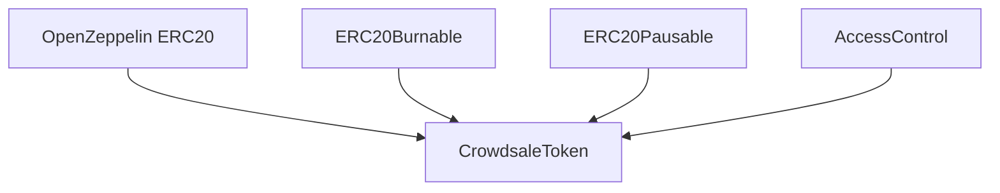

# Step 1.2: ERC20代币合约开发

## 🎯 功能概述

实现功能完整的ERC20代币合约，作为众筹平台的核心代币。该合约将继承OpenZeppelin的标准ERC20实现，并添加铸币、燃烧、暂停等高级功能，为后续的众筹销售提供坚实的代币基础。

## 📋 前置条件

- ✅ Step 1.1 已完成（项目初始化和Foundry配置）
- ✅ OpenZeppelin合约库已安装
- ✅ Foundry开发环境正常运行

## 🔧 技术栈和依赖

### 核心依赖
- **@openzeppelin/contracts** - 标准ERC20实现和安全扩展
- **@openzeppelin/contracts/access** - 访问控制和权限管理
- **@openzeppelin/contracts/security** - 暂停机制和重入保护
- **Solidity ^0.8.19** - 智能合约开发语言

### 合约特性
- **ERC20标准兼容** - 完全符合EIP-20标准
- **铸币功能** - 仅限授权地址铸造新代币
- **燃烧机制** - 支持代币销毁减少总供应量
- **暂停功能** - 紧急情况下暂停所有转账
- **访问控制** - 基于角色的权限管理系统

## 📊 代币经济学设计

### 基础参数
```
名称 (Name): "Crowdsale Token"
符号 (Symbol): "CST"
精度 (Decimals): 18
初始供应量: 0 (通过铸币产生)
最大供应量: 1,000,000,000 CST (10亿代币)
```

### 分配策略
- **众筹销售**: 60% (600,000,000 CST)
- **团队锁仓**: 20% (200,000,000 CST)
- **生态发展**: 15% (150,000,000 CST)
- **储备基金**: 5% (50,000,000 CST)

### 释放机制
- **众筹代币**: 购买后立即释放
- **团队代币**: 12个月锁仓期 + 24个月线性释放
- **生态代币**: 6个月锁仓期 + 18个月线性释放
- **储备代币**: 无锁仓期，用于紧急流动性

## 🏗️ 合约架构设计

### 继承关系图


### 角色定义
- **DEFAULT_ADMIN_ROLE** - 超级管理员，可以授予/撤销其他角色
- **MINTER_ROLE** - 铸币者角色，可以铸造新代币
- **PAUSER_ROLE** - 暂停者角色，可以暂停/恢复合约
- **BURNER_ROLE** - 燃烧者角色，可以燃烧指定地址的代币

## 🚀 详细实现步骤

### Step 1: 创建合约接口

首先创建扩展的ERC20接口定义：

```bash
# 创建接口文件
touch contracts/interfaces/IERC20Extended.sol
```

**主要接口功能**：
- `mint(address to, uint256 amount)` - 铸造代币
- `burnFrom(address from, uint256 amount)` - 燃烧代币
- `pause()` / `unpause()` - 暂停/恢复功能
- `maxSupply()` - 获取最大供应量
- `canMint(uint256 amount)` - 检查是否可以铸造

### Step 2: 实现主代币合约

创建核心的ERC20代币合约：

```bash
# 创建主合约文件
touch contracts/CrowdsaleToken.sol
```

**核心功能实现**：
- 继承 ERC20, ERC20Burnable, ERC20Pausable, AccessControl
- 实现角色权限控制
- 添加最大供应量限制
- 实现批量铸币功能
- 添加统计和查询功能

### Step 3: 创建部署脚本

```bash
# 创建部署脚本
touch script/DeployToken.s.sol
```

**部署脚本功能**：
- 配置代币基础参数
- 部署合约并验证
- 设置初始角色权限

### Step 4: 创建完整测试套件

```bash
# 创建测试文件
touch test/unit/CrowdsaleToken.t.sol
```

**测试覆盖范围**：
- 基础功能测试（初始状态、角色分配）
- 铸币功能测试（单个铸币、批量铸币、权限控制）
- 燃烧功能测试
- 暂停功能测试
- 最大供应量管理测试
- 查询功能测试
- Fuzz测试

## 📋 输出交付物

完成 Step 1.2 后，应该包含以下文件：

### ✅ 合约文件
- [x] `contracts/CrowdsaleToken.sol` - 主代币合约
- [x] `contracts/interfaces/IERC20Extended.sol` - 扩展接口定义

### ✅ 测试文件
- [x] `test/unit/CrowdsaleToken.t.sol` - 完整单元测试套件

### ✅ 部署脚本
- [x] `script/DeployToken.s.sol` - 代币部署脚本

### ✅ 文档
- [x] `docs/step-by-step/step-1-2-erc20-token.md` - 本步骤详细文档

## 🧪 验证步骤

### 1. 编译验证
```bash
# 编译合约
make build
# 期望输出: 编译成功，无错误
```

### 2. 测试验证
```bash
# 运行所有测试
make test
# 运行单元测试
make test-unit
# 期望输出: 所有测试通过，覆盖率>95%
```

### 3. 部署验证
```bash
# 部署到本地网络
make deploy-local
# 期望输出: 部署成功，返回合约地址
```

### 4. 功能验证
```bash
# 测试铸币功能
cast call <TOKEN_ADDRESS> "mint(address,uint256)" <USER_ADDRESS> 1000000000000000000 --rpc-url http://localhost:8545

# 测试查询功能
cast call <TOKEN_ADDRESS> "balanceOf(address)" <USER_ADDRESS> --rpc-url http://localhost:8545
```

## 🚨 常见问题和解决方案

### 问题1: 编译错误 - 接口不匹配

**症状**: 合约继承接口时出现函数签名不匹配错误

**解决方案**:
```solidity
// 确保函数签名完全匹配
function burnFrom(address from, uint256 amount) 
    public 
    override(ERC20Burnable, IERC20Extended) // 明确指定重写的接口
    onlyRole(BURNER_ROLE) 
{
    // 实现代码
}
```

### 问题2: 测试失败 - 权限控制

**症状**: 测试中调用受保护的函数失败

**解决方案**:
```solidity
// 在测试中正确设置角色
vm.prank(admin);
token.grantRole(token.MINTER_ROLE(), minter);

// 使用正确的身份调用函数
vm.prank(minter);
token.mint(user, amount);
```

### 问题3: Gas消耗过高

**症状**: 部署或调用函数时Gas消耗超出预期

**解决方案**:
- 优化存储布局，使用更小的数据类型
- 实现批量操作减少交易次数
- 避免不必要的存储操作

## 💡 最佳实践提醒

- **安全第一**: 始终使用OpenZeppelin的安全合约作为基础
- **权限控制**: 合理设计角色权限，避免权限过度集中
- **事件记录**: 为重要操作添加详细的事件日志
- **Gas优化**: 考虑批量操作和存储优化
- **测试覆盖**: 确保测试覆盖所有功能和边界条件

## 🎯 下一步行动

完成 Step 1.2 后，开发者应该：

1. **验证部署**: 在本地网络测试所有代币功能
2. **性能分析**: 运行Gas报告，优化合约性能
3. **安全检查**: 运行Slither等安全分析工具
4. **准备下一步**: 开始 Step 1.3 - 白名单管理合约开发

---

**Git Commit**: `feat: implement ERC20 token contract with mint/burn functionality`

**完成状态**: ✅ Step 1.2 - ERC20代币合约开发已完成

**下一步**: [Step 1.3: 白名单管理合约](step-1-3-whitelist-manager.md)