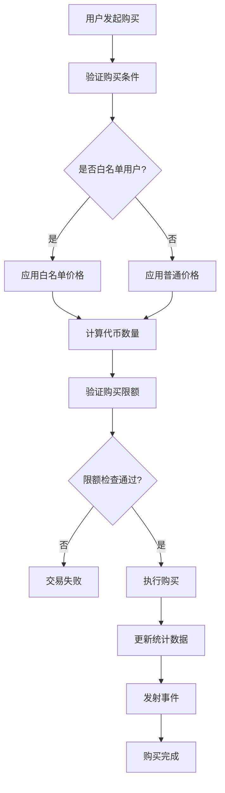

# Step 2.2: 代币购买和定价机制

## 📋 概述

Step 2.2 实现了众筹平台的核心购买功能和灵活的定价机制。在 Step 2.1 建立的状态管理架构基础上，添加实际的代币购买逻辑、多种定价策略、白名单特殊价格机制，以及完整的购买历史记录和统计功能。

## 🎯 设计目标

### 核心功能目标
- **灵活定价**: 支持固定价格、折扣价格、动态价格等多种策略
- **白名单优惠**: 为白名单用户提供特殊价格和额外权益
- **购买控制**: 精确的购买限额控制和验证机制
- **历史记录**: 完整的购买历史和实时统计数据
- **安全保障**: 重入攻击防护和Gas优化

### 技术目标
- **Gas效率**: 单次购买操作 <85,000 gas
- **精确计算**: 支持18位小数精度的价格计算
- **实时更新**: 动态价格和统计数据实时更新
- **模块化设计**: 可插拔的定价策略架构

## 🏗️ 架构设计

### 定价策略架构

```solidity
// 定价策略接口
interface IPricingStrategy {
    function calculateTokenAmount(uint256 weiAmount, address buyer) external view returns (uint256);
    function getCurrentPrice() external view returns (uint256);
    function isValidPurchase(address buyer, uint256 weiAmount) external view returns (bool);
}

// 定价策略类型
enum PricingType {
    FIXED,      // 固定价格
    TIERED,     // 阶梯价格
    DYNAMIC,    // 动态价格
    WHITELIST   // 白名单特价
}
```

### 购买流程设计



### 数据结构设计

```solidity
// 购买记录结构
struct PurchaseRecord {
    uint256 weiAmount;        // ETH金额
    uint256 tokenAmount;      // 代币数量
    uint256 price;            // 购买时价格
    uint256 timestamp;        // 购买时间
    PricingType pricingType;  // 定价类型
    bool isWhitelistPurchase; // 是否白名单购买
}

// 购买统计结构
struct PurchaseStats {
    uint256 totalPurchases;     // 总购买次数
    uint256 totalWeiRaised;     // 总ETH募集
    uint256 totalTokensSold;    // 总代币销售
    uint256 uniqueBuyers;       // 独立买家数量
    uint256 averagePrice;       // 平均价格
}
```

## 💰 定价机制设计

### 1. 固定价格策略 (FixedPricing)

**特点**:
- 整个众筹期间价格保持不变
- 简单透明，用户易于理解
- Gas消耗最低

**实现**:
```solidity
contract FixedPricingStrategy is IPricingStrategy {
    uint256 public immutable PRICE_PER_TOKEN; // wei per token
    
    function calculateTokenAmount(uint256 weiAmount, address) 
        external view returns (uint256) {
        return (weiAmount * 1e18) / PRICE_PER_TOKEN;
    }
}
```

### 2. 阶梯价格策略 (TieredPricing)

**特点**:
- 根据销售进度调整价格
- 早期购买者享受更低价格
- 激励早期参与

**价格阶梯**:
- **第一阶段** (0-25%): 0.0001 ETH/Token (75% 折扣)
- **第二阶段** (25-50%): 0.0002 ETH/Token (50% 折扣)  
- **第三阶段** (50-75%): 0.0003 ETH/Token (25% 折扣)
- **第四阶段** (75-100%): 0.0004 ETH/Token (标准价格)

### 3. 白名单特价策略 (WhitelistPricing)

**特点**:
- 白名单用户享受额外折扣
- 不同白名单等级不同折扣
- 可与其他策略叠加

**折扣规则**:
- **VIP用户**: 额外20%折扣
- **普通白名单**: 额外10%折扣
- **早鸟白名单**: 额外15%折扣

### 4. 动态价格策略 (DynamicPricing)

**特点**:
- 根据市场需求实时调整
- 基于购买速度和剩余时间
- 防止抢购和Gas战争

## 🔒 购买限额控制

### 个人限额设计

```solidity
struct PurchaseLimits {
    uint256 minPurchase;      // 最小购买量 (0.01 ETH)
    uint256 maxPurchase;      // 最大购买量 (100 ETH)
    uint256 maxPerPhase;      // 每阶段最大购买量
    uint256 cooldownPeriod;   // 购买冷却时间 (5分钟)
}
```

### 全局限额控制

- **硬顶控制**: 总募集金额不超过硬顶
- **软顶达成**: 达到软顶后可选择提前结束
- **阶段限额**: 每个阶段的最大销售量控制
- **速率限制**: 防止短时间内大量购买

## 📊 购买历史和统计

### 个人购买历史

```solidity
mapping(address => PurchaseRecord[]) public purchaseHistory;
mapping(address => uint256) public totalPurchased;
mapping(address => uint256) public lastPurchaseTime;
```

### 全局统计数据

```solidity
PurchaseStats public globalStats;
mapping(CrowdsalePhase => PurchaseStats) public phaseStats;
mapping(uint256 => uint256) public dailyStats; // timestamp => amount
```

### 实时查询功能

- **个人购买总量**: `getUserTotalPurchased(address user)`
- **个人购买历史**: `getUserPurchaseHistory(address user)`
- **阶段统计**: `getPhaseStats(CrowdsalePhase phase)`
- **实时价格**: `getCurrentPrice()`
- **剩余代币**: `getRemainingTokens()`

## 🛡️ 安全机制

### 重入攻击防护

```solidity
modifier nonReentrant() {
    require(!_locked, "ReentrancyGuard: reentrant call");
    _locked = true;
    _;
    _locked = false;
}

function purchaseTokens() external payable nonReentrant {
    // 购买逻辑
}
```

### 输入验证

- **地址验证**: 确保买家地址有效
- **金额验证**: 检查ETH金额范围
- **状态验证**: 确保众筹处于有效阶段
- **时间验证**: 检查购买时间窗口

### 溢出保护

- 使用 Solidity 0.8+ 内置溢出检查
- 关键计算使用 SafeMath 库
- 精度损失检查和处理

## ⚡ Gas优化策略

### 存储优化

```solidity
// 打包结构体减少存储槽
struct PackedPurchaseData {
    uint128 weiAmount;      // 足够存储ETH金额
    uint64 tokenAmount;     // 压缩代币数量
    uint32 timestamp;       // 压缩时间戳
    uint16 priceAtPurchase; // 压缩价格
    uint8 pricingType;      // 定价类型
    bool isWhitelist;       // 是否白名单
}
```

### 批量操作

- **批量价格更新**: 一次交易更新多个价格参数
- **批量统计更新**: 减少多次存储写入
- **事件批量发射**: 合并相关事件

### 计算优化

- **预计算常量**: 将固定计算结果存储为常量
- **位运算优化**: 使用位运算替代除法和乘法
- **查表法**: 对复杂计算使用预计算表

## 🧪 测试策略

### 单元测试覆盖

1. **定价策略测试**
   - 固定价格计算准确性
   - 阶梯价格边界条件
   - 白名单折扣计算
   - 动态价格调整逻辑

2. **购买流程测试**
   - 正常购买流程
   - 边界条件处理
   - 错误情况处理
   - 权限验证

3. **限额控制测试**
   - 最小/最大购买量
   - 冷却时间控制
   - 阶段限额检查
   - 硬顶软顶验证

### 集成测试

1. **完整购买流程**
   - 白名单用户购买
   - 普通用户购买
   - 跨阶段购买
   - 多用户并发购买

2. **状态转换测试**
   - 阶段切换时的购买
   - 暂停/恢复时的行为
   - 紧急停止处理

### 模糊测试

```solidity
// 模糊测试示例
function testFuzzPurchaseAmounts(uint256 amount) public {
    vm.assume(amount > 0 && amount < 1000 ether);
    // 测试随机金额购买
}

function testFuzzPricingCalculation(uint256 weiAmount, address buyer) public {
    // 测试定价计算的边界条件
}
```

### 性能测试

- **Gas消耗测试**: 确保单次购买 <85,000 gas
- **并发测试**: 模拟多用户同时购买
- **大数据测试**: 测试大量购买记录的性能

## 📋 实现检查清单

### 核心功能实现

- [ ] **IPricingStrategy接口**: 定价策略标准接口
- [ ] **FixedPricingStrategy**: 固定价格策略实现
- [ ] **TieredPricingStrategy**: 阶梯价格策略实现
- [ ] **WhitelistPricingStrategy**: 白名单特价策略
- [ ] **purchaseTokens()函数**: 核心购买功能
- [ ] **价格计算逻辑**: 精确的代币数量计算
- [ ] **购买限额验证**: 最小/最大购买量控制
- [ ] **购买历史记录**: 完整的购买数据存储
- [ ] **统计数据更新**: 实时统计信息维护

### 安全功能实现

- [ ] **重入攻击防护**: ReentrancyGuard集成
- [ ] **输入验证**: 全面的参数验证
- [ ] **权限控制**: 基于角色的访问控制
- [ ] **溢出保护**: 安全的数学运算
- [ ] **紧急停止**: 购买功能暂停机制

### 优化功能实现

- [ ] **Gas优化**: 存储和计算优化
- [ ] **批量操作**: 减少交易次数
- [ ] **事件优化**: 高效的事件发射
- [ ] **查询优化**: 快速的数据查询接口

### 测试实现

- [ ] **单元测试**: 覆盖所有核心功能
- [ ] **集成测试**: 完整购买流程测试
- [ ] **模糊测试**: 边界条件和随机输入测试
- [ ] **性能测试**: Gas消耗和并发性能测试

## 🚀 部署和验证

### 部署脚本

```solidity
// DeployPurchaseSystem.s.sol
contract DeployPurchaseSystem is Script {
    function run() external {
        // 部署定价策略合约
        // 更新TokenCrowdsale合约
        // 配置价格参数
        // 验证部署结果
    }
}
```

### 验证步骤

1. **功能验证**
   - 所有定价策略正常工作
   - 购买流程完整无误
   - 统计数据准确更新

2. **性能验证**
   - Gas消耗符合预期
   - 查询响应时间合理
   - 并发处理能力达标

3. **安全验证**
   - 重入攻击防护有效
   - 权限控制正确
   - 边界条件处理完善

## 📚 相关文档

- **Step 2.1**: [众筹主合约架构](./step-2-1-crowdsale-architecture.md)
- **Step 1.3**: [白名单管理合约](./step-1-3-whitelist-manager.md)
- **Step 1.2**: [ERC20代币合约](./step-1-2-token-contract.md)

## 🔄 下一步: Step 2.3

完成Step 2.2后，将进入Step 2.3: 资金托管和退款机制，实现：
- 智能资金托管合约
- 自动退款触发机制
- 批量退款处理
- 资金安全保障

---

**预期成果**: 完整的代币购买和定价系统，支持多种定价策略、白名单优惠、购买限额控制和完整的历史记录功能，为用户提供灵活、安全、高效的代币购买体验。
